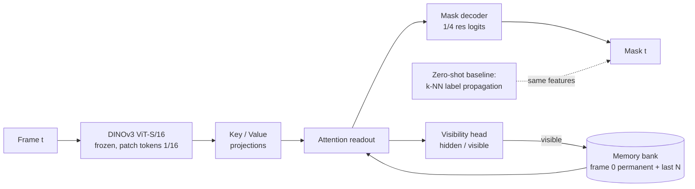

# DINOv3 VOS under occlusion

> Semi-supervised video object segmentation (mask given on frame 0, propagate it through the video) with a **frozen DINOv3** encoder and a small trainable **memory head** whose job is to survive occlusions: stop updating memory when the object is hidden, say "hidden" instead of guessing, and re-acquire the object when it reappears.

**Status: scaffold, no results yet.** See [docs/plan.md](docs/plan.md) for milestones.



## Why this exists

DINOv3 patch features already track by nearest-neighbour label propagation (the DINO video-segmentation protocol). That baseline fails in a specific way under occlusion: the memory keeps absorbing the occluder, the mask drifts onto it, and nothing brings the object back. The three fixes are architectural, not a bigger backbone:

1. **Gated memory update** — no write while the visibility head says hidden.
2. **Explicit visibility output** — trained on frames where the ground truth says the object is not visible.
3. **Permanent frame-0 memory** — re-identification after reappearance matches against the clean template, not the polluted recent frames.

The backbone stays frozen. Fine-tuning dense features without an anchor degrades them; if adaptation is ever needed it goes in as LoRA on the last blocks with a Gram-matrix consistency loss against the frozen model, as a separate ablation.

## Data

- **DAVIS 2017 trainval 480p** — 60 train / 30 val sequences, 4,209 / 1,999 frames, CC BY 4.0 (Pont-Tuset et al. 2017). Train split for the head, val split for every reported number.
- **Synthetic occlusions with ground truth**: objects cut from *other* DAVIS sequences are pasted over the target for a contiguous episode of frames. Visible mask, full mask, occluder mask and occlusion fraction are stored per frame, so recovery can be measured exactly.
- **Real occlusions** are detected from the annotation itself: an object whose mask area drops to zero between two non-empty frames.

Everything is public. No client data, no client names.

## Metrics

Standard **J** (region IoU), **F** (boundary), **J&F**. Plus three occlusion-specific numbers, all computed from the stored episodes:

| Metric | Question it answers |
|---|---|
| `recovery_delay` | how many frames after the occluder leaves until J ≥ 0.5 again |
| `leak_ratio` | how much of the predicted mask sits on the occluder while the object is hidden |
| `visibility_auc` | does the model know when it cannot see the object |

## Layout

```
configs/default.yaml     resolution, model, memory, training hyper-parameters
scripts/download_davis.sh
src/dvos/backbone.py     DINOv3 loading (local repo + cached weights), feature extraction
src/dvos/davis.py        DAVIS reader, real-occlusion episode detection
src/dvos/occlusion.py    synthetic occluder bank, schedule, pasting with ground truth
src/dvos/propagate.py    zero-shot k-NN label propagation baseline
src/dvos/model.py        memory bank, key/value encoders, readout, decoder, visibility head, losses
src/dvos/metrics.py      J, F, recovery delay, leak ratio
src/dvos/extract.py      CLI: cache features + occlusion variants to disk
src/dvos/train.py        CLI: train the head on cached features
src/dvos/evaluate.py     CLI: baseline or checkpoint → metrics JSON + table
tests/                   unit tests on synthetic tensors, no weights needed
```

## Quick start

```bash
make setup          # uv venv (py3.12) + deps
make test           # unit tests, no data, no weights
make data           # DAVIS 2017 trainval 480p (~800 MB)
make extract        # cache DINOv3 features: clean + 2 occluded variants per sequence
make baseline       # zero-shot propagation on val, clean and occluded
make train          # memory head, laptop-scale
make eval           # checkpoint on val
```

Weights: `backbone.py` looks for DINOv3 checkpoints in `~/.cache/torch/hub/checkpoints/` and imports the model code from the sibling `../dinov3` clone (override with `DINOV3_REPO`). The DINOv3 weights come under Meta's DINOv3 licence, not MIT; accept it on the official page before downloading.

## What this does NOT show

- It does not fine-tune DINOv3. Every number is "frozen features + small head". A LoRA ablation is planned, not done.
- It does not handle out-of-view the same as occlusion. Both look like "mask area zero" in DAVIS; the synthetic protocol only produces occlusions.
- Single-target evaluation everywhere: the first object id of each sequence. Multi-object DAVIS scoring is not implemented.
- Laptop compute: ViT-S/16 at 480×864, features cached once. No claim about ViT-L or 7B behaviour.
- Results, until `runs/` has them.

## Licence

Code MIT. DINOv3 weights under Meta's DINOv3 licence. DAVIS 2017 under CC BY 4.0; cite Pont-Tuset et al., *The 2017 DAVIS Challenge on Video Object Segmentation*, arXiv:1704.00675.
