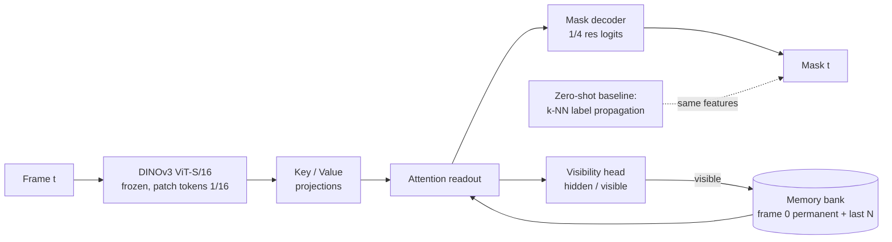

# DINOv3 VOS under occlusion

> Semi-supervised video object segmentation: given a mask on frame 0, propagate it through video with frozen DINOv3 features and a small trainable memory head that survives occlusions — stops updating under hidden state, signals visibility, re-acquires on reappearance.

**Result:** DAVIS 2017 val — zero-shot DINOv3 k-NN reaches J&F 0.767 clean, 0.673 under full occlusion. Four memory heads (3.4M parameters each) never beat it on J&F; training with occlusions buys behaviour: leak 0.93 → 0.60, visibility AUC 0.80 → 0.91, at cost of 4–7 J&F points elsewhere. Details in [Results](#results) and [docs/article.md](docs/article.md).



## Why this exists

DINOv3 k-NN label propagation works but fails under occlusion: the memory absorbs the occluder and the mask drifts onto it. Three architectural fixes:

1. **Gated memory update** — freeze memory when visibility head says hidden.
2. **Visibility output** — trained on frames where ground truth is empty.
3. **Permanent frame-0 memory** — re-identify against clean template after reappearance.

Backbone stays frozen (fine-tuning dense features without an anchor degrades them). LoRA + Gram-matrix anchor planned as a separate ablation.

## Data

- **DAVIS 2017 trainval 480p** — 60 train / 30 val sequences, 4,209 / 1,999 frames, CC BY 4.0 (Pont-Tuset et al. 2017).
- **Synthetic occlusions** — objects from training sequences pasted over target for 4–12 frames, sized 1.2–1.8× target box. Visible/full/occluder masks and fraction stored per frame; **hidden** = fraction ≥ 0.9 or empty mask.
- **Real occlusions** — detected when mask area drops to zero between non-empty frames.

Public data, no client content.

## Metrics

Standard **J** (region IoU), **F** (boundary), **J&F**, scored on frames 1..T−2 as in the official DAVIS protocol (first frame given, last frame excluded). Both are re-implemented here under MIT and checked against the reference `davis2017-evaluation` package (GPL, therefore not a dependency): J identical, F identical to machine precision on DAVIS val frames (`tests/test_metrics.py`, runs when the reference package is installed). Plus three occlusion-specific numbers, all computed from the stored episodes:

| Metric | Question it answers |
|---|---|
| `recovery_delay` | how many frames after the occluder leaves until J ≥ 0.5 again |
| `leak_ratio` | how much of the predicted mask sits on the occluder while the object is hidden |
| `visibility_auc` | does the model know when it cannot see the object (hidden = fraction ≥ 0.9 or empty mask) |

## Layout

```
configs/default.yaml     resolution, model, memory, training hyper-parameters
scripts/download_davis.sh
src/dvos/backbone.py     DINOv3 loading (local repo + cached weights), feature extraction
src/dvos/davis.py        DAVIS reader, real-occlusion episode detection
src/dvos/occlusion.py    synthetic occluder bank, schedule, pasting with ground truth
src/dvos/propagate.py    zero-shot k-NN label propagation baseline
src/dvos/model.py        memory bank, key/value encoders, readout, decoder, visibility head, losses
src/dvos/metrics.py      J, F, recovery delay, leak ratio
src/dvos/extract.py      CLI: cache features + occlusion variants to disk
src/dvos/video.py        CLI: overlay MP4/GIF per sequence, optional side-by-side compare
src/dvos/train.py        CLI: train the head on cached features
src/dvos/evaluate.py     CLI: baseline or checkpoint → metrics JSON + table
tests/                   unit tests on synthetic tensors, no weights needed
```

## Quick start

```bash
make setup          # uv venv (py3.12) + deps
make test           # unit tests, no data, no weights
make data           # DAVIS 2017 trainval 480p (~800 MB)
make extract        # cache DINOv3 features: clean + 2 occluded variants per sequence
make baseline       # zero-shot propagation on val, clean and occluded
make train          # memory head, laptop-scale
make eval           # checkpoint on val
```

Weights: `backbone.py` looks for DINOv3 checkpoints in `~/.cache/torch/hub/checkpoints/` and imports the model code from the sibling `../dinov3` clone (override with `DINOV3_REPO`). The DINOv3 weights come under Meta's DINOv3 licence, not MIT; accept it on the official page before downloading.

## Results

Everything below is on DAVIS 2017 val, single target per sequence, frames 1..T−1. `occ0`/`occ1` are two seeds of the synthetic full-occlusion protocol (occluder 1.2–1.8× the target, convex hull, 4–12 frames; 91 % / 76 % of episode frames hidden). Every number is reproducible with `scripts/run_all.sh` then `scripts/run_gated.sh`; the tables are generated by `scripts/render_results.py --inject README.md`.

<!-- results:start -->
#### Main comparison (DAVIS 2017 val, 30 sequences, largest object on frame 0)

| method | clean J&F | occ0 J&F | occ1 J&F | occ0 leak | occ0 vis AUC | occ0 never recovered |
|---|---|---|---|---|---|---|
| zero-shot k-NN propagation | 0.767 | 0.673 | 0.682 | 0.927 | 0.797 | 3 / 30 |
| zero-shot propagation + learned visibility gate | 0.767 | 0.673 | 0.682 | 0.927 | 0.848 | 3 / 30 |
| head v1 (soft memory masks) | 0.637 | 0.589 | 0.597 | 0.466 | 0.753 | 6 / 30 |
| head v2 (+ hard masks, gapped clips, held-out selection) | 0.670 | 0.630 | 0.617 | 0.544 | 0.733 | 4 / 30 |
| head v3 (+ position channels, locality window) | 0.708 | 0.633 | 0.631 | 0.674 | 0.643 | 5 / 30 |
| head v4 (+ zero-shot prior, calibrated gate) | 0.702 | 0.625 | 0.629 | 0.596 | 0.908 | 3 / 30 |

#### Where the accuracy goes (occ0, per-frame J)

| method (occ0) | J inside episode | J 10 frames after | J elsewhere |
|---|---|---|---|
| zero-shot k-NN propagation | 0.050 | 0.729 | 0.768 |
| zero-shot propagation + learned visibility gate | 0.050 | 0.729 | 0.768 |
| head v1 (soft memory masks) | 0.220 | 0.595 | 0.630 |
| head v2 (+ hard masks, gapped clips, held-out selection) | 0.239 | 0.667 | 0.665 |
| head v3 (+ position channels, locality window) | 0.143 | 0.648 | 0.685 |
| head v4 (+ zero-shot prior, calibrated gate) | 0.133 | 0.687 | 0.697 |

#### v4 ablations

| ablation (occ0) | J&F | leak | vis AUC | never recovered |
|---|---|---|---|---|
| v4, calibrated gate, frame 0 permanent | 0.625 | 0.596 | 0.908 | 3 / 30 |
| v4, gate chosen by J | 0.611 | 0.566 | 0.848 | 4 / 30 |
| v4, ungated writes | 0.611 | 0.566 | 0.848 | 4 / 30 |
| v4, FIFO memory (frame 0 evictable) | 0.622 | 0.594 | 0.907 | 3 / 30 |
| v4 trained on clean features only | 0.642 | 0.878 | 0.632 | 2 / 30 |
| v4 trained on clean only, evaluated on clean | 0.731 | – | – | – |
<!-- results:end -->

**How to read it.**

- Zero-shot loses 9 J&F points under occlusion, all inside the episode: it paints the occluder (leak 0.93, J 0.05 inside) and recovers immediately as the occluder leaves, because frame 0 stays in context. Its weakness is not re-acquisition but not knowing the object is gone.
- None of the head versions beat zero-shot on clean J&F. Rows v1–v3 are scored with the current inference loop, so comparable to v4 but not identical to their motivating runs.
- What training with occlusions buys vs clean-only training: leak 0.88 → 0.60, visibility AUC 0.63 → 0.91, J inside episode 0.05 → 0.13. Cost: 2.9 J&F on clean, 1.7 under occlusion.
- Gated writes improve over ungated by +1.4 J&F and +0.06 visibility AUC. Frame-0 permanence has no effect once reads are spatially local.
- Applying the head's visibility score as a hard gate on zero-shot propagation does not survive calibration (best gate on held-out train sequences: 0.0). Oracle gate of 0.3 on val gives +1.5 J and halves the leak.

| oracle gate on zero-shot propagation (val occ0) | J | leak | J inside episode |
|---|---|---|---|
| 0.0 (= baseline) | 0.666 | 0.937 | 0.050 |
| 0.3 | 0.681 | 0.501 | 0.316 |
| 0.5 | 0.673 | 0.390 | 0.341 |
| 0.9 | 0.593 | 0.262 | 0.379 |

**Qualitative.** Worst / median / best sequence by J, three frames each: just before the episode, inside it, a few frames after. Prediction in red, ground-truth visible mask in green, occluder in yellow.

*Head v4 (`docs/figures/qualitative_occ0.png`)* — inside the episode the occluder stays unpainted for the median and best case; the worst case is the instance-confusion failure (every scooter in the row gets painted).


*Zero-shot baseline (`docs/figures/qualitative_baseline_occ0.png`)* — inside the episode the propagated mask fills the occluder, then snaps back.


## Videos

Side by side, zero-shot baseline (left) and head v4 (right), occluded variant `occ0`. Red fill = prediction, green = ground-truth visible mask, yellow = occluder. The gauge is the visibility score against the run's gate; the verdict flips to HIDDEN when the head declares the object gone.

`dog` — the intended behaviour: while the occluder is present the baseline paints it (J = 0, still "visible"), the head returns an empty mask (J = 1, "hidden"); both re-acquire the dog three frames later.


`shooting` — median case. `scooter-black` — worst case, the instance-confusion failure (every scooter in the row gets painted).


Regenerate any sequence with `python -m dvos.video --run runs/head_occ0 --compare runs/baseline_occ0 --seq <name> --out docs/videos/<name>.mp4 --gif docs/videos/<name>.gif`.

## Study 2 — polyps in colonoscopy

Same head, same metrics, same pipeline (`scripts/run_polyp.sh`), on public colonoscopy data where the object really does disappear and come back: behind folds, behind instruments, out of the field of view.

| dataset | role | ground truth | size used | licence |
|---|---|---|---|---|
| [LDPolypVideo](https://github.com/dashishi/LDPolypVideo-Benchmark) (Ma et al., MICCAI 2021) | train (TrainValid, 100 videos) and test (60 videos) | per-frame boxes, no identities | 560×480, stride 2, first 50 / 80 cached frames per clip | research use, see repo |
| [PolypGen](https://github.com/DebeshJha/PolypGen) positive sequences (Ali et al., Sci Data 2023) | extra mask-level test set, 7 of 23 sequences | per-frame masks | 512×640 | open access (Sci Data) |
| [Kvasir-Instrument](https://datasets.simula.no/kvasir-instrument/) (Jha et al., MMM 2021) | occluder bank for the synthetic variant | instrument masks, 590 images | as is | CC BY 4.0 |

**Protocol differences.** Clip starts at first annotated frame (54/60 test clips begin before polyp visible). Target is largest box, tracked via IoU association and nearest centre; predicted mask scored by bounding box on box datasets. **Real episodes** = box-less frames between boxed frames: 69 in 60 test clips (median 11, p90 35), 90 in training (median 14, p90 51). Occlusion and out-of-view reported as one class. Synthetic instrument occlusions kept as controlled variant. Features cached as uint8 with per-tensor scale.

<!-- polyp-results:start -->
**Result:** Frozen DINOv3 features fail to separate polyps from mucosa. Zero-shot reaches J&F 0.137 on LDPolypVideo test (vs 0.77 on DAVIS); memory head beats it by 7 points (0.208). On mask-level PolypGen: leak drops 0.52 → 0.01, visibility AUC rises 0.48 → 0.74. Encoder is the bottleneck, not method — see LoRA ablation plan.

#### LDPolypVideo test, 60 clips, box IoU on filled boxes

| method | clean J&F | occ0 J&F | occ0 leak | occ0 vis AUC | real episodes never re-acquired (clean) |
|---|---|---|---|---|---|
| zero-shot k-NN propagation | 0.137 | 0.136 | 0.078 | 0.642 | 21 / 38 |
| head, gated (calibrated gate 0.4) | 0.208 | 0.196 | 0.121 | 0.696 | 19 / 38 |
| head, ungated writes | 0.213 | 0.196 | 0.113 | 0.698 | 17 / 38 |
| head, FIFO memory | – | 0.192 | 0.124 | 0.691 | – |

#### PolypGen positive sequences, 7 held-out sequences, mask J

| method | clean J | clean F | occ0 J&F | occ0 leak | occ0 vis AUC |
|---|---|---|---|---|---|
| zero-shot k-NN propagation | 0.457 | 0.422 | 0.292 | 0.517 | 0.478 |
| head trained on LDPolypVideo | 0.462 | 0.303 | 0.301 | **0.010** | **0.742** |

#### Where the accuracy goes (LDPolypVideo, per-frame box IoU)

| method | inside real episode (GT empty) | 10 frames after | elsewhere | median re-acquisition delay |
|---|---|---|---|---|
| zero-shot, clean | 0.876 | 0.062 | 0.113 | 12 |
| head, clean | 0.598 | 0.169 | 0.241 | 12 |
| zero-shot, occ0 | 0.325 | 0.087 | 0.125 | 9 |
| head, occ0 | 0.262 | 0.197 | 0.250 | 4.5 |

**How to read it.**

- "Inside real episode" is inflated by the empty-equals-empty convention: the ground truth is an empty box, so a tracker predicting nothing scores 1.0. The relevant column is *elsewhere*: 0.11 for zero-shot, 0.25 for the head — both localization failures, not occlusion handling.
- Polyps are small (median 2.1 % of frame, short side ≈ 4 patches). Zero-shot locks onto mucosa texture; the head, with position channels and locality window, re-acquires faster after real disappearances (median 4.5 frames vs 9 on occ0) but from weak signal.
- Gated vs ungated writes are within noise. Visibility head still transfers: on PolypGen leak drops 0.52 → 0.01.
- One run, one seed, boxes with heuristic matching. Numbers say "encoder", not "method" — next experiment is LoRA on last DINOv3 blocks with Gram anchor on public polyp stills.

*Videos:* `docs/videos/polyp_133_occ0.gif` (best occluded clip), `docs/videos/polyp_144_clean.gif` (best clean clip) and `docs/videos/polyp_147_long.gif` (a full 465-frame clip with five real disappearance episodes, the longest 108 frames; here the zero-shot baseline scores 0.585 J&F against the head's 0.396, cached uncapped via `configs/polyp_long.yaml`). Baseline left, head right.


<!-- polyp-results:end -->

## Study 3 — running it on a Jetson Nano

Full write-up: [docs/edge.md](docs/edge.md). Same frozen ViT-S/16 on 2019 Jetson Nano (TensorRT 8.2, Maxwell, compute 5.3) with CSI camera.

**The FP16 engines return NaN** — TensorRT 8.2 has no native LayerNorm, decomposed variance overflows on ViT activations, and `trtexec` never checks output. Correctness costs ~1.4x latency.

**Dropping resolution costs 3.4 J&F on DAVIS** — at 384×672 track is lost under real occlusion and never re-acquired; at 480×864 it recovers. DAVIS val has few full occlusions, so this is invisible in the benchmark.

| input | patch tokens | J&F (DAVIS val) | fps (Nano, FP32) | GPU ms/frame |
|---|---|---|---|---|
| 192×336 | 252 | 0.428 | 6.37 | 157 |
| 320×576 | 720 | 0.666 | 2.28 | 438 |
| 384×672 | 1008 | 0.733 | 1.50 | 666 |
| 480×864 | 1620 | 0.767 | 0.75 | 1337 |

Full quality runs at 0.75 fps (33x short of real time). Re-detection outside propagation vote recovers some of it (J 0.006 → 0.668 at 384×672); reference silhouettes from photographs give pixel-accurate borders and occlusion estimates (r=0.96 across 10.9x scale gap). See [docs/edge.md](docs/edge.md) for findings and limitations discovered in later measurements.

## What this does NOT show

- No fine-tuning of DINOv3. All numbers: frozen features + small head. LoRA ablation planned, not done.
- No separate handling of out-of-view vs occlusion; both appear as zero mask area in DAVIS.
- Single-target only: largest object on frame 0. Multi-object DAVIS not implemented.
- Laptop compute: ViT-S/16 at 480×864, features cached once. Training split cached at stride 2 to fit disk.
- Gate threshold calibrated on eight held-out training sequences, never val. Checkpoint selection sees no val frame.
- One run, one seed per configuration. Point-or-two differences may be within seed variance.
- Head failures concentrated in multi-instance scenes. Locality window helps; stronger identity model needed.

## Licence

Code MIT. DINOv3 weights under Meta's DINOv3 licence. DAVIS 2017 under CC BY 4.0; cite Pont-Tuset et al., *The 2017 DAVIS Challenge on Video Object Segmentation*, arXiv:1704.00675.
