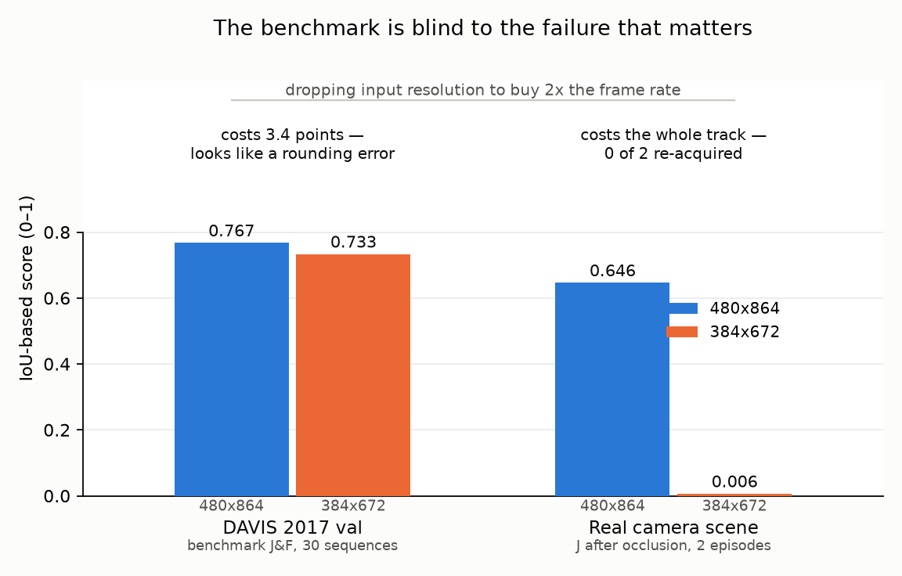
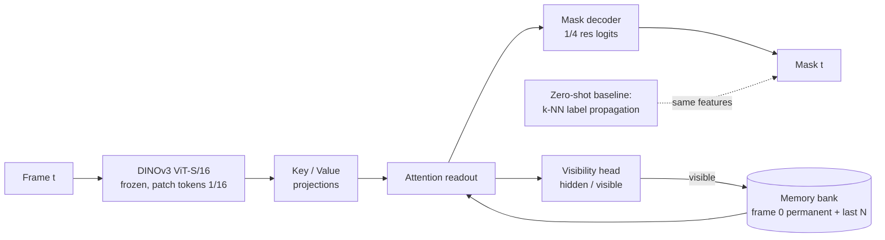

# Foundation models, measured honestly, on real hardware

> I took a frozen DINOv3 video-segmentation stack off a workstation, put it on a €100 Jetson Nano with a camera attached, and measured what actually happened. I went in looking for a latency number. I came out with three findings, none of which was the latency number. The code, the data and the failures are all here.

**The 60-second version**

- **The fast engine computed nothing, and the standard benchmark tool certified it as healthy.** Every FP16 TensorRT engine returned NaN for every pixel. `trtexec` reported clean throughput for all of them — it feeds random input and never looks at the output.
- **The benchmark couldn't see the failure that mattered.** Dropping resolution to buy frame rate costs 3.4 J&F points on DAVIS, and costs the entire track on real video. The number that governs the decision is blind to the thing the decision breaks.
- **Diagnosing that inverted the trade-off.** A re-detection branch turned the *cheap* configuration into the better one: twice the frame rate *and* better post-occlusion tracking.
- **The headline model never beat its own baseline.** Four trained memory heads, 3.4M parameters each, and not one of them beat zero-shot k-NN on J&F. I'm showing them anyway, because the diagnosis is the deliverable — and the diagnosis says *encoder*, not *method*.


Full quality runs at **0.75 fps — 33× short of real time**. There's no operating point on this curve where this architecture is live on this board, and saying so plainly is the result.

---

## 1. The fast engine computed nothing

The engines built. They ran. `trtexec` reported 9.04 fps at 192×336 with tight percentiles, and a runner I'd written independently reproduced those timings on real camera frames to within 1%. Two measurements agreeing with each other is usually where you stop looking.

Then the saved features — 113 MB of them — gzipped down to 153 KB, because they were uniform NaN.

```
fp32 feat_0000.npy  finite 96768/96768  min -0.2223  max 0.4502
fp16 feat_0000.npy  finite      0/96768  min     nan  max     nan
```

TensorRT 8.2 has no native LayerNormalization op, so the exported graph carries the decomposition instead, and the variance term `Pow(x, 2)` overflows fp16's 65504 ceiling on ViT activations. Numerically dead from the first block onward. Correctness costs about 1.4× latency.

A throughput number from `trtexec` certifies that an engine *runs*, not that it computes the function you asked for. I'd guess a large fraction of published edge-inference numbers are produced exactly this way, and nothing in the tool's output tells the two cases apart. The three-line finiteness check in `jetson_infer.py` is the only reason this is a finding here rather than a number in a table somewhere.

## 2. The benchmark was blind to the failure that mattered



At 384×672 the mask tracks the object, loses it to a real hand occlusion, and never gets it back — through a full reappearance and then a second occlusion. Re-acquisition goes from 2 of 2 to 0 of 2; the visibility head falls from 0.845 AUC to 0.534, which is chance. DAVIS sees none of this, because DAVIS val contains few full occlusions and scores an average over frames rather than asking whether the object was ever found again.

So the obvious way to buy frame rate on an edge device quietly removes the one capability the system exists for.

Getting ground truth for this cost no labelling at all. The trick lives in the scene, not the code: make the *target* trivially segmentable (an orange ball, a hue window) and let the *occluder* be arbitrary (a hand). You get exact per-frame masks on real optics with real auto-exposure, and the target is still free to move however it likes.

## 3. The fix inverted the trade-off

A global cosine match between the frame-0 target and every patch of a later frame separates cleanly at 384×672, long after the mask has died — on-target 0.95 against background p99 0.68. The encoder never lost the object; the voting scheme did. Which suggests using the exemplar *outside* the vote: when the mask dies, stop propagating and re-seed from a global match.

| configuration | fps | J after occlusion |
|---|---|---|
| 480×864, propagation only | 0.75 | 0.646 |
| **384×672 + gated re-detection** | **1.50** | **0.668** |

Twice the frame rate, and slightly better post-occlusion tracking into the bargain. The make-or-buy answer isn't "lower resolution costs you the track." It's "lower resolution costs you the track *unless* you add the branch — and once you have the branch, the frame rate is free."

The full write-up, including two wrong guesses and the measurement that ended them: **[docs/edge.md](docs/edge.md)**.

---

## What the system is

Semi-supervised video object segmentation: given a mask on frame 0, propagate it through the video using frozen DINOv3 features plus a small trainable memory head built to survive occlusion — it stops updating while the target is hidden, signals visibility, and re-acquires on reappearance.



k-NN label propagation on DINOv3 works nicely until something occludes the target — then the memory absorbs the occluder and the mask drifts onto it. Three fixes follow from that: a **gated memory update** (freeze memory when visibility says hidden), a **visibility output** (trained on frames where the ground truth is empty), and a **permanent frame-0 memory** (so there's a clean template to re-identify against after reappearance). The backbone stays frozen throughout.

**Why the standard metrics weren't enough.** J&F will happily tell you the tracker is fine while it paints the occluder. So there are three more, all computed from stored episodes: `leak_ratio` (how much of the mask sits on the occluder while the object is hidden), `recovery_delay` (frames until J ≥ 0.5 after the occluder leaves), and `visibility_auc` (does the model know it can't see). J and F are re-implemented here under MIT and checked against the GPL reference `davis2017-evaluation`: J identical, F identical to machine precision (`tests/test_metrics.py`).


Left: the zero-shot baseline paints the occluder (J = 0, still reporting "visible"). Right: the head returns an empty mask (J = 1, "hidden"). Both re-acquire three frames later.

## The honest scoreboard — DAVIS 2017 val

None of the four heads beat zero-shot on J&F. Training with occlusions doesn't buy accuracy; it buys *behaviour* — leak 0.93 → 0.60, visibility AUC 0.80 → 0.91, at a cost of 4–7 J&F points elsewhere. Reproduce with `scripts/run_all.sh` then `scripts/run_gated.sh`; the tables below are generated by `scripts/render_results.py --inject README.md`.

<!-- results:start -->
#### Main comparison (DAVIS 2017 val, 30 sequences, largest object on frame 0)

| method | clean J&F | occ0 J&F | occ1 J&F | occ0 leak | occ0 vis AUC | occ0 never recovered |
|---|---|---|---|---|---|---|
| zero-shot k-NN propagation | 0.767 | 0.673 | 0.682 | 0.927 | 0.797 | 3 / 30 |
| zero-shot propagation + learned visibility gate | 0.767 | 0.673 | 0.682 | 0.927 | 0.848 | 3 / 30 |
| head v1 (soft memory masks) | 0.637 | 0.589 | 0.597 | 0.466 | 0.753 | 6 / 30 |
| head v2 (+ hard masks, gapped clips, held-out selection) | 0.670 | 0.630 | 0.617 | 0.544 | 0.733 | 4 / 30 |
| head v3 (+ position channels, locality window) | 0.708 | 0.633 | 0.631 | 0.674 | 0.643 | 5 / 30 |
| head v4 (+ zero-shot prior, calibrated gate) | 0.702 | 0.625 | 0.629 | 0.596 | 0.908 | 3 / 30 |

#### Where the accuracy goes (occ0, per-frame J)

| method (occ0) | J inside episode | J 10 frames after | J elsewhere |
|---|---|---|---|
| zero-shot k-NN propagation | 0.050 | 0.729 | 0.768 |
| zero-shot propagation + learned visibility gate | 0.050 | 0.729 | 0.768 |
| head v1 (soft memory masks) | 0.220 | 0.595 | 0.630 |
| head v2 (+ hard masks, gapped clips, held-out selection) | 0.239 | 0.667 | 0.665 |
| head v3 (+ position channels, locality window) | 0.143 | 0.648 | 0.685 |
| head v4 (+ zero-shot prior, calibrated gate) | 0.133 | 0.687 | 0.697 |

#### v4 ablations

| ablation (occ0) | J&F | leak | vis AUC | never recovered |
|---|---|---|---|---|
| v4, calibrated gate, frame 0 permanent | 0.625 | 0.596 | 0.908 | 3 / 30 |
| v4, gate chosen by J | 0.611 | 0.566 | 0.848 | 4 / 30 |
| v4, ungated writes | 0.611 | 0.566 | 0.848 | 4 / 30 |
| v4, FIFO memory (frame 0 evictable) | 0.622 | 0.594 | 0.907 | 3 / 30 |
| v4 trained on clean features only | 0.642 | 0.878 | 0.632 | 2 / 30 |
| v4 trained on clean only, evaluated on clean | 0.731 | – | – | – |
<!-- results:end -->

**How to read it.** Zero-shot loses 9 J&F under occlusion, and all of it happens inside the episode: it paints the occluder (leak 0.93, J 0.05 inside) and then snaps straight back the moment the occluder leaves, because frame 0 is still sitting in its context. Its weakness isn't re-acquisition — it's not knowing the object is gone in the first place. Gated writes beat ungated by +1.4 J&F and +0.06 visibility AUC. Applying the head's visibility score as a hard gate on zero-shot looks promising but doesn't survive calibration; an oracle gate of 0.3 would give +1.5 J and halve the leak, which is a fair measure of the prize on offer if the gate were better. Qualitative strips, per-sequence breakdowns and the full argument live in **[docs/article.md](docs/article.md)**.

## Does it transfer? Colonoscopy says: not on frozen features

Same head, same metrics, same pipeline, now on public colonoscopy video where the object genuinely disappears — behind folds, behind instruments, out of the field of view entirely. [LDPolypVideo](https://github.com/dashishi/LDPolypVideo-Benchmark) (160 clips, boxes), [PolypGen](https://github.com/DebeshJha/PolypGen) (masks), [Kvasir-Instrument](https://datasets.simula.no/kvasir-instrument/) (occluder bank).

<!-- polyp-results:start -->
**Frozen DINOv3 features do not separate polyps from mucosa.** Zero-shot reaches J&F 0.137 on LDPolypVideo test against 0.767 on DAVIS. The memory head beats it by 7 points (0.208) and re-acquires twice as fast after real disappearances (median 4.5 frames vs 9), but from weak signal.

| method | clean J&F | occ0 J&F | occ0 leak | occ0 vis AUC | real episodes never re-acquired |
|---|---|---|---|---|---|
| zero-shot k-NN propagation | 0.137 | 0.136 | 0.078 | 0.642 | 21 / 38 |
| head, gated (calibrated gate 0.4) | 0.208 | 0.196 | 0.121 | 0.696 | 19 / 38 |

The visibility head is the part that transfers: on mask-level PolypGen, leak drops **0.52 → 0.01** and visibility AUC rises **0.48 → 0.74**. Polyps are small — median 2.1% of frame, short side ≈ 4 patches — and zero-shot locks onto mucosa texture.

**The numbers say encoder, not method.** Next experiment is LoRA on the last DINOv3 blocks with a Gram anchor, not another head. One run, one seed, boxes with heuristic matching.


<!-- polyp-results:end -->

## What this does NOT show

- **No fine-tuning of DINOv3.** Every number here is frozen features plus a small head. The LoRA ablation is planned, not done.
- **One board, one backbone, one camera scene.** The Jetson Nano is 2019 silicon with no tensor cores, so don't assume any of the FP16 behaviour transfers to an Orin. The NaN is specific to TensorRT 8.2 — 8.6 and later have a native LayerNorm. What does transfer is the claim about `trtexec` not validating outputs.
- **The resolution cliff is measured, not established.** 120 frames, two episodes, one object class. Treat it as a reason to test re-acquisition on *your* footage before you pick a resolution, not as a number to quote.
- **One run, one seed per configuration.** A point or two of difference may well be seed variance. Gate thresholds were calibrated on held-out training sequences, never on val, and checkpoint selection never sees a val frame.
- **Single target only**, the largest object on frame 0. Multi-object DAVIS isn't implemented, and the head's failures cluster in multi-instance scenes.
- **No power or thermal measurement**, no INT8, no pruning, no distillation, no LayerNorm plugin. Any of these could move the Pareto front; none of them were tried.

## What this would take on your data

- **A day** to port a frozen encoder and produce the latency/accuracy curve for your resolutions and your board — including the engine-build failures, which is where the surprises tend to live.
- **A day** to build an automatic-ground-truth scene for your failure mode. The trick generalises: make the thing you're measuring trivially detectable, and let whatever causes the failure stay arbitrary. That's what makes the numbers exact without anyone labelling a frame.
- **The deliverable** is the make-or-buy answer: the resolution and precision where your accuracy requirement and your frame-rate requirement actually meet — and an honest statement when they don't meet at all, which on this board with this model is what happened.

## Run it

```bash
make setup     # uv venv (py3.12) + deps
make test      # unit tests, no data, no weights needed
make data      # DAVIS 2017 trainval 480p (~800 MB)
make extract   # cache DINOv3 features: clean + 2 occluded variants
make baseline  # zero-shot propagation on val
make train     # memory head, laptop-scale
make eval      # checkpoint on val -> metrics JSON + tables
```

```
src/dvos/     backbone (frozen DINOv3) · davis · occlusion · propagate · model · metrics
              extract / train / evaluate / video  (CLIs)
tools/        ONNX export · Jetson capture & inference · scene eval · silhouette tracking · figures
scripts/      dataset downloads · run_all.sh · run_gated.sh · run_polyp.sh · render_results.py
docs/         edge.md (the Jetson write-up) · article.md (the DAVIS study) · figures · videos
```

Weights: `backbone.py` looks for DINOv3 checkpoints in `~/.cache/torch/hub/checkpoints/` and imports the model code from a sibling `../dinov3` clone (override with `DINOV3_REPO`). The data directories aren't in this repo — `make data` and `scripts/download_polyp.sh` fetch them.

## Licence

Code MIT. DINOv3 weights are under Meta's DINOv3 licence, not MIT — accept it on the official page before downloading. DAVIS 2017 is CC BY 4.0; cite Pont-Tuset et al., *The 2017 DAVIS Challenge on Video Object Segmentation*, arXiv:1704.00675.
