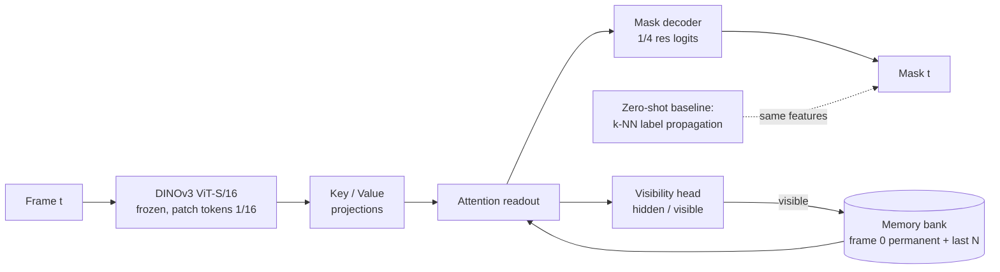
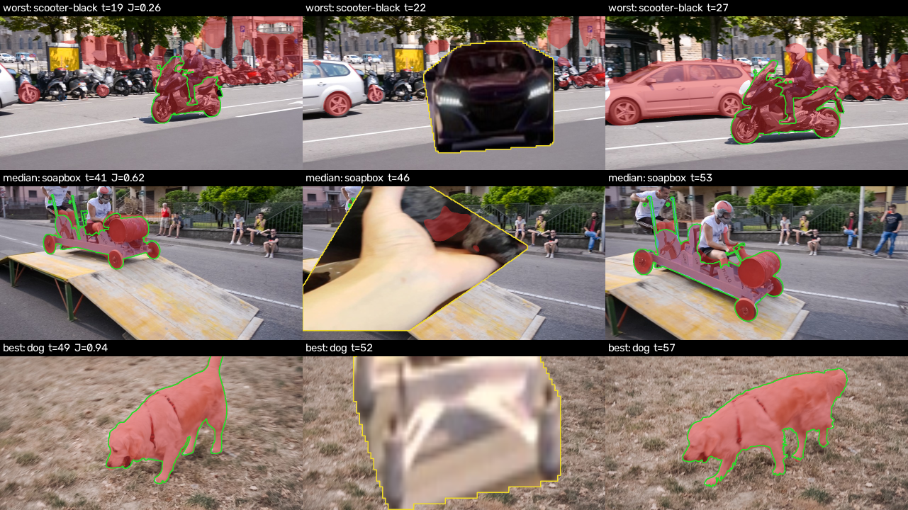
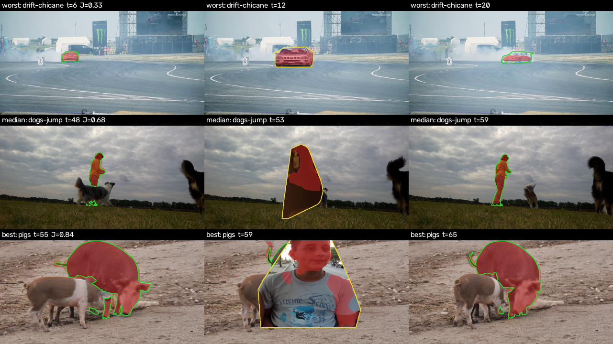
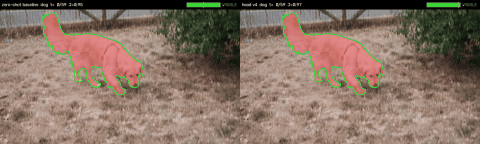
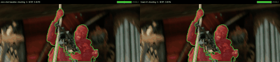
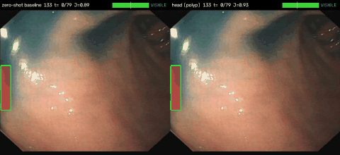

# DINOv3 VOS under occlusion

> Semi-supervised video object segmentation (mask given on frame 0, propagate it through the video) with a **frozen DINOv3** encoder and a small trainable **memory head** whose job is to survive occlusions: stop updating memory when the object is hidden, say "hidden" instead of guessing, and re-acquire the object when it reappears.

**Result, in one line:** on DAVIS 2017 val the frozen-DINOv3 zero-shot propagation is hard to beat (J&F 0.767 clean, 0.673 under full occlusion); four versions of a 3.4M-parameter memory head never beat it on J&F, and what training with occlusions buys is *behaviour under occlusion* — leak onto the occluder 0.93 → 0.60, visibility AUC 0.80 → 0.91 — at a cost of 4–7 J&F points elsewhere. Details in [Results](#results) and [docs/article.md](docs/article.md).



## Why this exists

DINOv3 patch features already track by nearest-neighbour label propagation (the DINO video-segmentation protocol). That baseline fails in a specific way under occlusion: the memory keeps absorbing the occluder, the mask drifts onto it, and nothing brings the object back. The three fixes are architectural, not a bigger backbone:

1. **Gated memory update** — no write while the visibility head says hidden.
2. **Explicit visibility output** — trained on frames where the ground truth says the object is not visible.
3. **Permanent frame-0 memory** — re-identification after reappearance matches against the clean template, not the polluted recent frames.

The backbone stays frozen. Fine-tuning dense features without an anchor degrades them; if adaptation is ever needed it goes in as LoRA on the last blocks with a Gram-matrix consistency loss against the frozen model, as a separate ablation.

## Data

- **DAVIS 2017 trainval 480p** — 60 train / 30 val sequences, 4,209 / 1,999 frames, CC BY 4.0 (Pont-Tuset et al. 2017). Train split for the head, val split for every reported number.
- **Synthetic occlusions with ground truth**: objects cut from *training* sequences are pasted over the target for a contiguous episode of 4–12 frames, sized 1.2–1.8× the target's box so the episode actually hides it. Visible mask, full mask, occluder mask and occluded fraction are stored per frame; a frame counts as **hidden** when the fraction is ≥ 0.9 or the mask is empty. That label trains the visibility head, scores `vis AUC`, and calibrates the gate.
- **Real occlusions** are detected from the annotation itself: an object whose mask area drops to zero between two non-empty frames.

Everything is public. No client data, no client names.

## Metrics

Standard **J** (region IoU), **F** (boundary), **J&F**, scored on frames 1..T−2 as in the official DAVIS protocol (first frame given, last frame excluded). Both are re-implemented here under MIT and checked against the reference `davis2017-evaluation` package (GPL, therefore not a dependency): J identical, F identical to machine precision on DAVIS val frames (`tests/test_metrics.py`, runs when the reference package is installed). Plus three occlusion-specific numbers, all computed from the stored episodes:

| Metric | Question it answers |
|---|---|
| `recovery_delay` | how many frames after the occluder leaves until J ≥ 0.5 again |
| `leak_ratio` | how much of the predicted mask sits on the occluder while the object is hidden |
| `visibility_auc` | does the model know when it cannot see the object (hidden = fraction ≥ 0.9 or empty mask) |

## Layout

```
configs/default.yaml     resolution, model, memory, training hyper-parameters
scripts/download_davis.sh
src/dvos/backbone.py     DINOv3 loading (local repo + cached weights), feature extraction
src/dvos/davis.py        DAVIS reader, real-occlusion episode detection
src/dvos/occlusion.py    synthetic occluder bank, schedule, pasting with ground truth
src/dvos/propagate.py    zero-shot k-NN label propagation baseline
src/dvos/model.py        memory bank, key/value encoders, readout, decoder, visibility head, losses
src/dvos/metrics.py      J, F, recovery delay, leak ratio
src/dvos/extract.py      CLI: cache features + occlusion variants to disk
src/dvos/video.py        CLI: overlay MP4/GIF per sequence, optional side-by-side compare
src/dvos/train.py        CLI: train the head on cached features
src/dvos/evaluate.py     CLI: baseline or checkpoint → metrics JSON + table
tests/                   unit tests on synthetic tensors, no weights needed
```

## Quick start

```bash
make setup          # uv venv (py3.12) + deps
make test           # unit tests, no data, no weights
make data           # DAVIS 2017 trainval 480p (~800 MB)
make extract        # cache DINOv3 features: clean + 2 occluded variants per sequence
make baseline       # zero-shot propagation on val, clean and occluded
make train          # memory head, laptop-scale
make eval           # checkpoint on val
```

Weights: `backbone.py` looks for DINOv3 checkpoints in `~/.cache/torch/hub/checkpoints/` and imports the model code from the sibling `../dinov3` clone (override with `DINOV3_REPO`). The DINOv3 weights come under Meta's DINOv3 licence, not MIT; accept it on the official page before downloading.

## Results

Everything below is on DAVIS 2017 val, single target per sequence, frames 1..T−1. `occ0`/`occ1` are two seeds of the synthetic full-occlusion protocol (occluder 1.2–1.8× the target, convex hull, 4–12 frames; 91 % / 76 % of episode frames hidden). Every number is reproducible with `scripts/run_all.sh` then `scripts/run_gated.sh`; the tables are generated by `scripts/render_results.py --inject README.md`.

<!-- results:start -->
#### Main comparison (DAVIS 2017 val, 30 sequences, largest object on frame 0)

| method | clean J&F | occ0 J&F | occ1 J&F | occ0 leak | occ0 vis AUC | occ0 never recovered |
|---|---|---|---|---|---|---|
| zero-shot k-NN propagation | 0.767 | 0.673 | 0.682 | 0.927 | 0.797 | 3 / 30 |
| zero-shot propagation + learned visibility gate | 0.767 | 0.673 | 0.682 | 0.927 | 0.848 | 3 / 30 |
| head v1 (soft memory masks) | 0.637 | 0.589 | 0.597 | 0.466 | 0.753 | 6 / 30 |
| head v2 (+ hard masks, gapped clips, held-out selection) | 0.670 | 0.630 | 0.617 | 0.544 | 0.733 | 4 / 30 |
| head v3 (+ position channels, locality window) | 0.708 | 0.633 | 0.631 | 0.674 | 0.643 | 5 / 30 |
| head v4 (+ zero-shot prior, calibrated gate) | 0.702 | 0.625 | 0.629 | 0.596 | 0.908 | 3 / 30 |

#### Where the accuracy goes (occ0, per-frame J)

| method (occ0) | J inside episode | J 10 frames after | J elsewhere |
|---|---|---|---|
| zero-shot k-NN propagation | 0.050 | 0.729 | 0.768 |
| zero-shot propagation + learned visibility gate | 0.050 | 0.729 | 0.768 |
| head v1 (soft memory masks) | 0.220 | 0.595 | 0.630 |
| head v2 (+ hard masks, gapped clips, held-out selection) | 0.239 | 0.667 | 0.665 |
| head v3 (+ position channels, locality window) | 0.143 | 0.648 | 0.685 |
| head v4 (+ zero-shot prior, calibrated gate) | 0.133 | 0.687 | 0.697 |

#### v4 ablations

| ablation (occ0) | J&F | leak | vis AUC | never recovered |
|---|---|---|---|---|
| v4, calibrated gate, frame 0 permanent | 0.625 | 0.596 | 0.908 | 3 / 30 |
| v4, gate chosen by J | 0.611 | 0.566 | 0.848 | 4 / 30 |
| v4, ungated writes | 0.611 | 0.566 | 0.848 | 4 / 30 |
| v4, FIFO memory (frame 0 evictable) | 0.622 | 0.594 | 0.907 | 3 / 30 |
| v4 trained on clean features only | 0.642 | 0.878 | 0.632 | 2 / 30 |
| v4 trained on clean only, evaluated on clean | 0.731 | – | – | – |
<!-- results:end -->

**How to read it.**

- The zero-shot k-NN propagation loses 9 J&F points under occlusion, and all of it *inside* the episode: it paints the occluder (leak 0.93, J 0.05 inside) and recovers as soon as the occluder leaves, because frame 0 is always in its context. Its weakness is not re-acquisition, it is not knowing that the object is gone.
- Each head version fixes the failure the previous one exposed (see the version table in the article), but none beats zero-shot on J&F, clean or occluded. Rows v1–v3 are those checkpoints scored with the *current* inference loop (hard memory masks, locality where their config has it), so they are comparable to v4 but not identical to the runs that motivated each fix. The head's own k-NN prior with *oracle* memory writes scores J 0.847 on the first 12 val sequences against 0.756 with its own writes: the remaining gap is error accumulation through the memory, not the decoder.
- What training with synthetic occlusions buys, against the same head trained on clean features only: leak 0.88 → 0.60, visibility AUC 0.63 → 0.91, J inside the episode 0.05 → 0.13. What it costs: 2.9 J&F points on clean sequences (0.731 → 0.702) and 1.7 under occlusion (0.642 → 0.625).
- The gated-write ablation now moves the needle, a little: +1.4 J&F and +0.06 visibility AUC over ungated writes. Frame-0 permanence changes nothing once reads are spatially local.
- Applying the head's visibility score as a hard gate on the zero-shot propagation does not survive calibration: on the held-out training sequences the best gate is 0.0, i.e. no gate. Tuned on val itself (an oracle, not a result) a gate of 0.3 gives +1.5 J and halves the leak:

| oracle gate on zero-shot propagation (val occ0) | J | leak | J inside episode |
|---|---|---|---|
| 0.0 (= baseline) | 0.666 | 0.937 | 0.050 |
| 0.3 | 0.681 | 0.501 | 0.316 |
| 0.5 | 0.673 | 0.390 | 0.341 |
| 0.9 | 0.593 | 0.262 | 0.379 |

**Qualitative.** Worst / median / best sequence by J, three frames each: just before the episode, inside it, a few frames after. Prediction in red, ground-truth visible mask in green, occluder in yellow.

*Head v4 (`docs/figures/qualitative_occ0.png`)* — inside the episode the occluder stays unpainted for the median and best case; the worst case is the instance-confusion failure (every scooter in the row gets painted).



*Zero-shot baseline (`docs/figures/qualitative_baseline_occ0.png`)* — inside the episode the propagated mask fills the occluder, then snaps back.



## Videos

Side by side, zero-shot baseline (left) and head v4 (right), occluded variant `occ0`. Red fill = prediction, green = ground-truth visible mask, yellow = occluder. The gauge is the visibility score against the run's gate; the verdict flips to HIDDEN when the head declares the object gone.

`dog` — the intended behaviour: while the occluder is present the baseline paints it (J = 0, still "visible"), the head returns an empty mask (J = 1, "hidden"); both re-acquire the dog three frames later.



`shooting` — median case. `scooter-black` — worst case, the instance-confusion failure (every scooter in the row gets painted).



Regenerate any sequence with `python -m dvos.video --run runs/head_occ0 --compare runs/baseline_occ0 --seq <name> --out docs/videos/<name>.mp4 --gif docs/videos/<name>.gif`.

## Study 2 — polyps in colonoscopy

Same head, same metrics, same pipeline (`scripts/run_polyp.sh`), on public colonoscopy data where the object really does disappear and come back: behind folds, behind instruments, out of the field of view.

| dataset | role | ground truth | size used | licence |
|---|---|---|---|---|
| [LDPolypVideo](https://github.com/dashishi/LDPolypVideo-Benchmark) (Ma et al., MICCAI 2021) | train (TrainValid, 100 videos) and test (60 videos) | per-frame boxes, no identities | 560×480, stride 2, first 50 / 80 cached frames per clip | research use, see repo |
| [PolypGen](https://github.com/DebeshJha/PolypGen) positive sequences (Ali et al., Sci Data 2023) | extra mask-level test set, 7 of 23 sequences | per-frame masks | 512×640 | open access (Sci Data) |
| [Kvasir-Instrument](https://datasets.simula.no/kvasir-instrument/) (Jha et al., MMM 2021) | occluder bank for the synthetic variant | instrument masks, 590 images | as is | CC BY 4.0 |

**Protocol differences from study 1.** A clip starts at its first annotated frame (54 of 60 test clips begin before the polyp is in view). The target is the largest box on that frame, followed through the unlabelled boxes by IoU association and nearest centre after a gap; on box datasets the predicted mask is scored by its bounding box. **Real episodes** are runs of box-less frames between boxed frames: 69 in the 60 test clips (median 11 frames, p90 35), 90 in the 100 training clips (median 14, p90 51, 24 of them 30+ frames). Occlusion and leaving the field of view are one class in the annotation and are reported as one. The synthetic instrument occlusions (`occ0`) are kept as the controlled variant. Features are cached as uint8 with a per-tensor scale to fit the disk.

<!-- polyp-results:start -->
**Result, in one line:** frozen DINOv3 features do not separate a polyp from the mucosa well enough to track it. Zero-shot propagation, which reached J&F 0.77 on DAVIS, reaches **0.137** (box IoU) on the LDPolypVideo test clips; the same head that never beat zero-shot on DAVIS beats it here by 7 points (**0.208**), and on the mask-level PolypGen set it removes the leak onto instruments entirely (0.52 → 0.01) and separates hidden from visible frames (visibility AUC 0.48 → 0.74). The encoder is the bottleneck, which is the case for the adaptation step this study did not run.

#### LDPolypVideo test, 60 clips, box IoU on filled boxes

| method | clean J&F | occ0 J&F | occ0 leak | occ0 vis AUC | real episodes never re-acquired (clean) |
|---|---|---|---|---|---|
| zero-shot k-NN propagation | 0.137 | 0.136 | 0.078 | 0.642 | 21 / 38 |
| head, gated (calibrated gate 0.4) | 0.208 | 0.196 | 0.121 | 0.696 | 19 / 38 |
| head, ungated writes | 0.213 | 0.196 | 0.113 | 0.698 | 17 / 38 |
| head, FIFO memory | – | 0.192 | 0.124 | 0.691 | – |

#### PolypGen positive sequences, 7 held-out sequences, mask J

| method | clean J | clean F | occ0 J&F | occ0 leak | occ0 vis AUC |
|---|---|---|---|---|---|
| zero-shot k-NN propagation | 0.457 | 0.422 | 0.292 | 0.517 | 0.478 |
| head trained on LDPolypVideo | 0.462 | 0.303 | 0.301 | **0.010** | **0.742** |

#### Where the accuracy goes (LDPolypVideo, per-frame box IoU)

| method | inside real episode (GT empty) | 10 frames after | elsewhere | median re-acquisition delay |
|---|---|---|---|---|
| zero-shot, clean | 0.876 | 0.062 | 0.113 | 12 |
| head, clean | 0.598 | 0.169 | 0.241 | 12 |
| zero-shot, occ0 | 0.325 | 0.087 | 0.125 | 9 |
| head, occ0 | 0.262 | 0.197 | 0.250 | 4.5 |

**How to read it.**

- "Inside real episode" is inflated by the empty-equals-empty convention: the ground truth there is an empty box, so a tracker that has already lost the polyp and predicts nothing scores 1.0. The column that matters is *elsewhere*: 0.11 for zero-shot, 0.25 for the head. Both are failures of localisation, not of occlusion handling.
- Polyps are small for a patch-16 encoder: median box 2.1 % of the frame, short side ≈ 4 patches, 11 % under 2 patches. The zero-shot k-NN locks onto mucosa texture within a few frames; the head, with position channels and a locality window, holds on longer and re-acquires faster after real disappearances (median 4.5 frames vs 9 on occ0) but from a weak signal.
- Training saw 392 held-out frames with 31 hidden ones; the calibrated gate (balanced accuracy 0.58) barely matters, and gated vs ungated writes are within noise here. The visibility head still transfers: on PolypGen the leak onto the instrument drops from 0.52 to 0.01.
- One training run, one seed, boxes with no identities followed by a heuristic. The numbers say "encoder", not "method": the next experiment is LoRA on the last DINOv3 blocks with a Gram anchor on public polyp stills (Kvasir-SEG is on disk), then this table again.

*Videos:* `docs/videos/polyp_133_occ0.gif` (best occluded clip) and `docs/videos/polyp_144_clean.gif` (best clean clip), baseline left, head right.


<!-- polyp-results:end -->

## What this does NOT show

- It does not fine-tune DINOv3. Every number is "frozen features + small head". A LoRA ablation is planned, not done.
- It does not handle out-of-view the same as occlusion. Both look like "mask area zero" in DAVIS; the synthetic protocol only produces occlusions.
- Single-target evaluation everywhere: the largest object on frame 0 of each sequence (the first id is degenerate in two val sequences). Multi-object DAVIS scoring is not implemented.
- Laptop compute: ViT-S/16 at 480×864, features cached once; the training split is cached at temporal stride 2 to fit the disk. No claim about ViT-L or 7B behaviour.
- The gate threshold is calibrated on eight held-out *training* sequences, never on val. Those eight are also the only validation signal during training, so checkpoint selection sees no val frame.
- One training run per configuration, one seed. Differences of a point or two between head versions are within what a second seed could move.
- The head's failures are concentrated in scenes with several similar instances (gold-fish, lab-coat, india, judo): a locality window helped, a stronger identity model would be needed.

## Licence

Code MIT. DINOv3 weights under Meta's DINOv3 licence. DAVIS 2017 under CC BY 4.0; cite Pont-Tuset et al., *The 2017 DAVIS Challenge on Video Object Segmentation*, arXiv:1704.00675.
