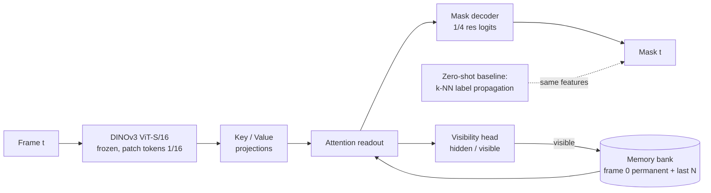

# DINOv3 VOS under occlusion

> Semi-supervised video object segmentation (mask given on frame 0, propagate it through the video) with a **frozen DINOv3** encoder and a small trainable **memory head** whose job is to survive occlusions: stop updating memory when the object is hidden, say "hidden" instead of guessing, and re-acquire the object when it reappears.

**Result, in one line:** on DAVIS 2017 val the frozen-DINOv3 zero-shot propagation is hard to beat (J&F 0.771 clean, 0.678 under full occlusion); four versions of a 3.4M-parameter memory head never beat it on J&F, and what training with occlusions buys is *behaviour under occlusion* — leak onto the occluder 0.93 → 0.60, visibility AUC 0.80 → 0.91 — at a cost of 4–7 J&F points elsewhere. Details in [Results](#results) and [docs/article.md](docs/article.md).



## Why this exists

DINOv3 patch features already track by nearest-neighbour label propagation (the DINO video-segmentation protocol). That baseline fails in a specific way under occlusion: the memory keeps absorbing the occluder, the mask drifts onto it, and nothing brings the object back. The three fixes are architectural, not a bigger backbone:

1. **Gated memory update** — no write while the visibility head says hidden.
2. **Explicit visibility output** — trained on frames where the ground truth says the object is not visible.
3. **Permanent frame-0 memory** — re-identification after reappearance matches against the clean template, not the polluted recent frames.

The backbone stays frozen. Fine-tuning dense features without an anchor degrades them; if adaptation is ever needed it goes in as LoRA on the last blocks with a Gram-matrix consistency loss against the frozen model, as a separate ablation.

## Data

- **DAVIS 2017 trainval 480p** — 60 train / 30 val sequences, 4,209 / 1,999 frames, CC BY 4.0 (Pont-Tuset et al. 2017). Train split for the head, val split for every reported number.
- **Synthetic occlusions with ground truth**: objects cut from *training* sequences are pasted over the target for a contiguous episode of 4–12 frames, sized 1.2–1.8× the target's box so the episode actually hides it. Visible mask, full mask, occluder mask and occluded fraction are stored per frame; a frame counts as **hidden** when the fraction is ≥ 0.9 or the mask is empty. That label trains the visibility head, scores `vis AUC`, and calibrates the gate.
- **Real occlusions** are detected from the annotation itself: an object whose mask area drops to zero between two non-empty frames.

Everything is public. No client data, no client names.

## Metrics

Standard **J** (region IoU), **F** (boundary), **J&F**. Plus three occlusion-specific numbers, all computed from the stored episodes:

| Metric | Question it answers |
|---|---|
| `recovery_delay` | how many frames after the occluder leaves until J ≥ 0.5 again |
| `leak_ratio` | how much of the predicted mask sits on the occluder while the object is hidden |
| `visibility_auc` | does the model know when it cannot see the object (hidden = fraction ≥ 0.9 or empty mask) |

## Layout

```
configs/default.yaml     resolution, model, memory, training hyper-parameters
scripts/download_davis.sh
src/dvos/backbone.py     DINOv3 loading (local repo + cached weights), feature extraction
src/dvos/davis.py        DAVIS reader, real-occlusion episode detection
src/dvos/occlusion.py    synthetic occluder bank, schedule, pasting with ground truth
src/dvos/propagate.py    zero-shot k-NN label propagation baseline
src/dvos/model.py        memory bank, key/value encoders, readout, decoder, visibility head, losses
src/dvos/metrics.py      J, F, recovery delay, leak ratio
src/dvos/extract.py      CLI: cache features + occlusion variants to disk
src/dvos/train.py        CLI: train the head on cached features
src/dvos/evaluate.py     CLI: baseline or checkpoint → metrics JSON + table
tests/                   unit tests on synthetic tensors, no weights needed
```

## Quick start

```bash
make setup          # uv venv (py3.12) + deps
make test           # unit tests, no data, no weights
make data           # DAVIS 2017 trainval 480p (~800 MB)
make extract        # cache DINOv3 features: clean + 2 occluded variants per sequence
make baseline       # zero-shot propagation on val, clean and occluded
make train          # memory head, laptop-scale
make eval           # checkpoint on val
```

Weights: `backbone.py` looks for DINOv3 checkpoints in `~/.cache/torch/hub/checkpoints/` and imports the model code from the sibling `../dinov3` clone (override with `DINOV3_REPO`). The DINOv3 weights come under Meta's DINOv3 licence, not MIT; accept it on the official page before downloading.

## Results

Everything below is on DAVIS 2017 val, single target per sequence, frames 1..T−1. `occ0`/`occ1` are two seeds of the synthetic full-occlusion protocol (occluder 1.2–1.8× the target, convex hull, 4–12 frames; 91 % / 76 % of episode frames hidden). Every number is reproducible with `scripts/run_all.sh` then `scripts/run_gated.sh`; the tables are generated by `scripts/render_results.py --inject README.md`.

<!-- results:start -->
#### Main comparison (DAVIS 2017 val, 30 sequences, largest object on frame 0)

| method | clean J&F | occ0 J&F | occ1 J&F | occ0 leak | occ0 vis AUC | occ0 never recovered |
|---|---|---|---|---|---|---|
| zero-shot k-NN propagation | 0.771 | 0.678 | 0.686 | 0.927 | 0.797 | 3 / 30 |
| zero-shot propagation + learned visibility gate | 0.771 | 0.678 | – | 0.927 | 0.848 | 3 / 30 |
| head v1 (soft memory masks) | 0.672 | 0.592 | 0.600 | 0.466 | 0.753 | 6 / 30 |
| head v2 (+ hard masks, gapped clips, held-out selection) | 0.691 | 0.634 | 0.620 | 0.544 | 0.733 | 4 / 30 |
| head v3 (+ position channels, locality window) | 0.718 | 0.637 | 0.634 | 0.674 | 0.643 | 5 / 30 |
| head v4 (+ zero-shot prior, calibrated gate) | 0.706 | 0.630 | 0.634 | 0.596 | 0.908 | 3 / 30 |

#### Where the accuracy goes (occ0, per-frame J)

| method (occ0) | J inside episode | J 10 frames after | J elsewhere |
|---|---|---|---|
| zero-shot k-NN propagation | 0.050 | 0.729 | 0.768 |
| zero-shot propagation + learned visibility gate | 0.050 | 0.729 | 0.768 |
| head v1 (soft memory masks) | 0.220 | 0.595 | 0.630 |
| head v2 (+ hard masks, gapped clips, held-out selection) | 0.239 | 0.667 | 0.665 |
| head v3 (+ position channels, locality window) | 0.143 | 0.648 | 0.685 |
| head v4 (+ zero-shot prior, calibrated gate) | 0.133 | 0.687 | 0.697 |

#### v4 ablations

| ablation (occ0) | J&F | leak | vis AUC | never recovered |
|---|---|---|---|---|
| v4, calibrated gate, frame 0 permanent | 0.630 | 0.596 | 0.908 | 3 / 30 |
| v4, ungated writes | 0.616 | 0.566 | 0.848 | 4 / 30 |
| v4, FIFO memory (frame 0 evictable) | 0.627 | 0.594 | 0.907 | 3 / 30 |
| v4 trained on clean features only | 0.646 | 0.878 | 0.632 | 2 / 30 |
| v4 trained on clean only, evaluated on clean | 0.734 | – | – | – |
<!-- results:end -->

**How to read it.**

- The zero-shot k-NN propagation loses 9 J&F points under occlusion, and all of it *inside* the episode: it paints the occluder (leak 0.93, J 0.05 inside) and recovers as soon as the occluder leaves, because frame 0 is always in its context. Its weakness is not re-acquisition, it is not knowing that the object is gone.
- Each head version fixes the failure the previous one exposed (see the version table in the article), but none beats zero-shot on J&F, clean or occluded. The head's own k-NN prior with *oracle* memory writes scores J 0.847 on the first 12 val sequences against 0.756 with its own writes: the remaining gap is error accumulation through the memory, not the decoder.
- What training with synthetic occlusions buys, against the same head trained on clean features only: leak 0.88 → 0.60, visibility AUC 0.63 → 0.91, J inside the episode 0.05 → 0.13. What it costs: 2.8 J&F points on clean sequences and 1.6 under occlusion.
- The gated-write ablation now moves the needle, a little: +1.4 J&F and +0.06 visibility AUC over ungated writes. Frame-0 permanence changes nothing once reads are spatially local.
- Applying the head's visibility score as a hard gate on the zero-shot propagation does not survive calibration: on the held-out training sequences the best gate is 0.0, i.e. no gate. Tuned on val itself (an oracle, not a result) a gate of 0.3 gives +1.5 J and halves the leak:

| oracle gate on zero-shot propagation (val occ0) | J | leak | J inside episode |
|---|---|---|---|
| 0.0 (= baseline) | 0.666 | 0.937 | 0.050 |
| 0.3 | 0.681 | 0.501 | 0.316 |
| 0.5 | 0.673 | 0.390 | 0.341 |
| 0.9 | 0.593 | 0.262 | 0.379 |

**Qualitative.** Worst / median / best sequence by J, three frames each: just before the episode, inside it, a few frames after. Prediction in red, ground-truth visible mask in green, occluder in yellow.

*Head v4 (`docs/figures/qualitative_occ0.png`)* — inside the episode the occluder stays unpainted for the median and best case; the worst case is the instance-confusion failure (every scooter in the row gets painted).


*Zero-shot baseline (`docs/figures/qualitative_baseline_occ0.png`)* — inside the episode the propagated mask fills the occluder, then snaps back.


## What this does NOT show

- It does not fine-tune DINOv3. Every number is "frozen features + small head". A LoRA ablation is planned, not done.
- It does not handle out-of-view the same as occlusion. Both look like "mask area zero" in DAVIS; the synthetic protocol only produces occlusions.
- Single-target evaluation everywhere: the largest object on frame 0 of each sequence (the first id is degenerate in two val sequences). Multi-object DAVIS scoring is not implemented.
- Laptop compute: ViT-S/16 at 480×864, features cached once; the training split is cached at temporal stride 2 to fit the disk. No claim about ViT-L or 7B behaviour.
- The gate threshold is calibrated on eight held-out *training* sequences, never on val. Those eight are also the only validation signal during training, so checkpoint selection sees no val frame.
- One training run per configuration, one seed. Differences of a point or two between head versions are within what a second seed could move.
- The head's failures are concentrated in scenes with several similar instances (gold-fish, lab-coat, india, judo): a locality window helped, a stronger identity model would be needed.

## Licence

Code MIT. DINOv3 weights under Meta's DINOv3 licence. DAVIS 2017 under CC BY 4.0; cite Pont-Tuset et al., *The 2017 DAVIS Challenge on Video Object Segmentation*, arXiv:1704.00675.
