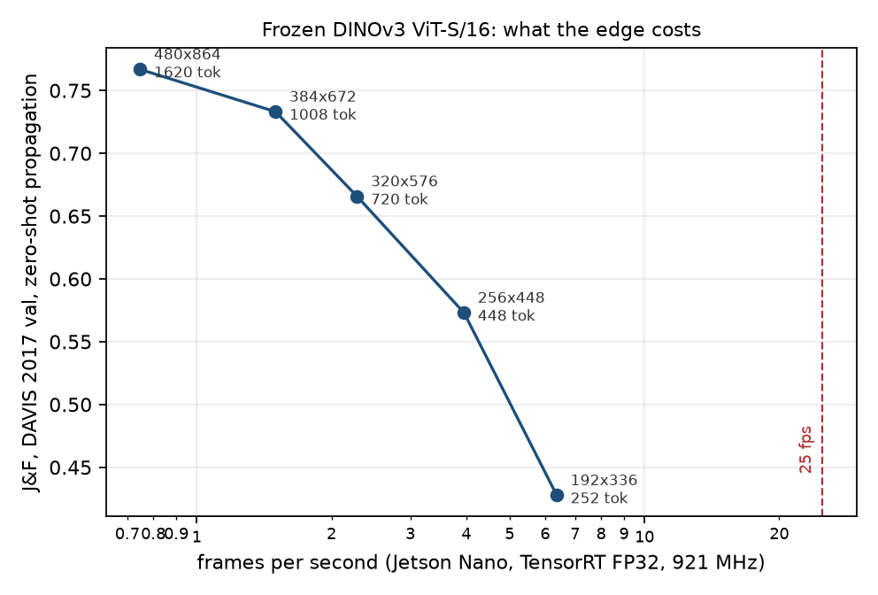
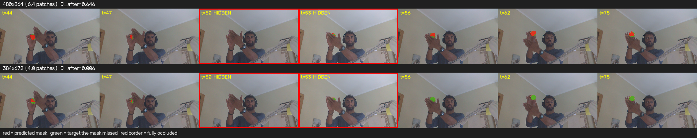
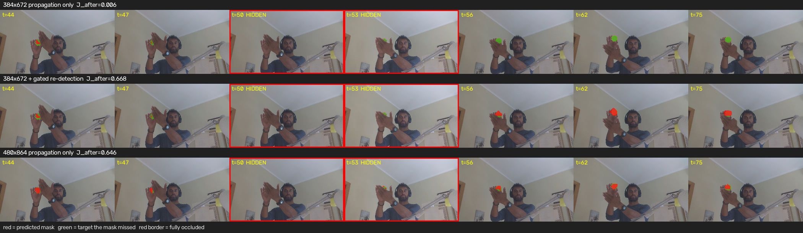
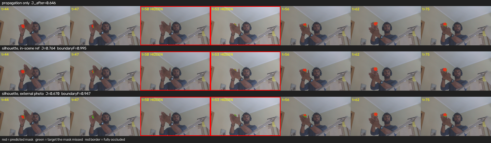

# Running this on a Jetson Nano: what the edge costs, and what the benchmark hides

A frozen DINOv3 ViT-S/16 propagating a mask through video, moved from a workstation onto a
2019 Jetson Nano with a camera attached. Two findings came out of it, and neither is the
latency number I went in for.

1. **The fast engine computes nothing, and the standard benchmark tool certifies it as healthy.**
   Every FP16 TensorRT engine built here returns NaN for every pixel. `trtexec` reported clean
   throughput for all of them, because it feeds random input and never inspects the output.
2. **Dropping the input resolution costs 3.4 J&F points on DAVIS and the entire track on real video.**
   At 384×672 the mask tracks the object, loses it to a real hand occlusion, and never
   re-acquires it — through a full reappearance and a second occlusion. DAVIS cannot see this,
   because DAVIS val contains few full occlusions.

Everything below is measured on public data and one camera scene, on hardware that costs
about €100. Numbers, code and the failures are all here.

---

## The board, and why it decides the shape of the work

`Jetson Nano Developer Kit`, L4T R32.7.6 (JetPack 4.6.6), Tegra X1, Maxwell GM20B,
**compute capability 5.3**. Ubuntu 18.04.6, Python 3.6.9, 4 GB shared between CPU and GPU,
4× Cortex-A57. CUDA 10.2, cuDNN 8.2.1, TensorRT 8.2.1. GPU pinned at its 921.6 MHz maximum
for every measurement; clock state is recorded in the header of each CSV.

Three consequences, all load-bearing:

- **FP16 is the ceiling.** cc 5.3 has no INT8 path and no tensor cores, ~472 GFLOPS FP16 peak.
  Any quantisation story below FP16 is not demonstrable on this board, and I do not tell one.
- **No on-device PyTorch.** JetPack 4.6 tops out at Python 3.6 and torch 1.10-era wheels;
  DINOv3 needs torch 2.x. The graph is therefore built on the workstation and only the engine
  runs on the board. That constraint is not an inconvenience, it is what anyone deploying to
  this class of hardware actually hits.
- **Nothing is installed on the device.** `trtexec` builds and times engines by itself, and the
  inference runner allocates device memory by calling `libcudart` through `ctypes` rather than
  pulling in pycuda. Twenty lines against one less dependency on a board that cannot run a
  modern pip.

## Export: three things TensorRT 8.2 would not accept

All three are export-time only. `tools/export_onnx.py --check-only` asserts the exported module
still returns what the pipeline's own feature extractor returns — max absolute error 1.0 × 10⁻⁶.

| problem | why | fix |
|---|---|---|
| `aten::scaled_dot_product_attention` does not exist below ONNX opset 14, and TRT 8.2 parses ≤ 13 | torch exports SDPA as a fused op from opset 14 | substitute the textbook `softmax(QKᵀ·s)V` during export |
| RoPE became a data-dependent `If`: `IIfConditionalOutputLayer inputs must have the same shape` | the patch grid reaches `rope_embed` as a traced tensor, so `max(H, W)` turns into a branch | precompute the sin/cos table for the fixed grid and return it as constants |
| the RoPE table is bf16 | TRT 8.2 cannot represent bf16 | widen to fp32; also pin `ir_version` to 8 |

The second one came with a free optimisation: that table was being rebuilt **once per block,
twelve times per frame**, for a value that cannot change at a static input size.

## The FP16 trap

The engines built. They ran. `trtexec` reported 9.04 fps at 192×336 and 2.06 fps at 384×672
with tight percentiles, and an independently written runner reproduced those timings on real
camera frames to within 1%. Two agreeing measurements.

Then the saved features — 113 MB of them — gzipped to 153 KB, because they were uniform NaN.

```
fp32 feat_0000.npy  finite 96768/96768  min -0.2223  max 0.4502
fp16 feat_0000.npy  finite      0/96768  min     nan  max     nan
```

TensorRT 8.2 has no native LayerNormalization op, so the exported graph carries the
decomposition, and the variance term `Pow(x, 2)` overflows fp16's 65504 ceiling on ViT
activations. The engine is numerically dead from the first block.

**`trtexec` never noticed because it feeds random input and never reads the output.** A
throughput number from it certifies that an engine runs, not that it computes the function.
That is worth saying plainly, because a large fraction of published edge-inference numbers are
produced exactly this way, and nothing in the tool's output distinguishes the two cases.

The same decomposition caused a second symptom: at 1620 tokens the FP16 build failed outright,
every candidate tactic killed by the CUDA launch watchdog. In FP32 that size builds in 730 s and
runs. One root cause, two failures. My first reading of that build failure — that the toolchain
rather than throughput set the quality ceiling — was wrong, and is withdrawn here rather than
quietly corrected.

Correctness costs about 1.4×:

| input | FP16 ms (NaN) | FP32 ms (correct) | cost |
|---|---|---|---|
| 192×336 | 110.5 | 156.8 | 1.42× |
| 256×448 | 184.1 | 252.7 | 1.37× |
| 320×576 | 321.7 | 438.0 | 1.36× |
| 384×672 | 484.3 | 666.1 | 1.38× |
| 480×864 | build fails | 1336.6 | — |

## The real Pareto

FP32, GPU at 921 MHz. Accuracy is zero-shot k-NN propagation on DAVIS 2017 val, scored on the
workstation at each input size; frame rate is `trtexec` on the board, confirmed by the runner.

| input | patch tokens | J&F (DAVIS val) | fps | GPU ms/frame | engine build |
|---|---|---|---|---|---|
| 192×336 | 252 | 0.428 | 6.37 | 157 | 227 s |
| 256×448 | 448 | 0.573 | 3.95 | 253 | 290 s |
| 320×576 | 720 | 0.666 | 2.28 | 438 | 380 s |
| 384×672 | 1008 | 0.733 | 1.50 | 666 | 480 s |
| 480×864 | 1620 | **0.767** | **0.75** | 1337 | 730 s |



Full quality runs at **0.75 fps — 33× short of 25 fps**. There is no operating point on this
curve where this architecture is live on this board. The achieved throughput is about 11% of
the board's FP16 peak, which is what a transformer does on a GPU with no tensor cores and a
LayerNorm expanded into seven elementwise ops.

## The camera scene, and how it gets ground truth for free

Real frames have no labels, and hand-labelling a hundred masks is not worth it. The way out is
in the scene design rather than the code: make the **target** trivially segmentable and occlude
it with something that is not. An orange ball, a hand, a static camera.

```
GT[t]      = largest connected blob in the target's hue window, every frame
hidden[t]  = that blob falls below 20 % of its median visible area
J[t]       = IoU of the propagated mask against GT[t]
```

All of it automatic, on real optics with real auto-exposure, **and the target is free to move** —
which a static-rig design with a thresholded occluder would have had to forbid. The occluder is
never thresholded, so nothing depends on what it is.

120 frames at 1280×720 produced two clean episodes, frames 48–53 and 92–98, with the ball fully
hidden in the middle of each. The raw area profile shows them without any model in the loop:

```
t=0..42   ~100 %   visible
t=43..48  134→13   hand arriving
t=49..51  0 0 0    fully hidden
t=52..57  3→79     reappearing
t=76..95  91→2     second occlusion, slower
t=96..98  0 0 0    fully hidden
t=99..119 21→105   reappearing, stable
```

## The resolution cliff

| input | target spans | method | J before | J after | visibility AUC | recovered |
|---|---|---|---|---|---|---|
| 480×864 | 6.4 patches | zero-shot | **0.742** | **0.646** | — | **2/2** |
| 480×864 | 6.4 patches | memory head | 0.591 | 0.370 | **0.845** | 2/2 |
| 384×672 | 4.0 patches | zero-shot | 0.653 | **0.006** | — | **0/2** |
| 384×672 | 4.0 patches | memory head | 0.307 | 0.005 | 0.534 | 0/2 |
| 192×336 | 1.0 patch | zero-shot | 0.015 | — | — | never tracked |



**DAVIS says 480×864 → 384×672 costs 3.4 J&F points. On this video it costs the whole track.**
Re-acquisition goes from 2 of 2 to 0 of 2, and the visibility head goes from 0.845 AUC to 0.534,
which is chance. The benchmark that governs the resolution decision is blind to the failure the
resolution decision causes, because DAVIS val has few full occlusions and scores an average over
frames rather than asking whether the object was ever found again.

For anyone deploying this, that is the result that matters: the obvious way to buy frame rate on
an edge device silently removes the one capability the system exists for.

A secondary note on the trained memory head. It is worse than zero-shot on J at both
resolutions, consistent with what it does on DAVIS. What it does buy is knowing when it cannot
see: 0.845 AUC against a real hand, against 0.91 on the synthetic pasted occluders it was
trained on. That is the honest case for it — not better masks, but calibrated doubt.

## Mechanism: one half established, one half refuted

The target spans 6.4 patches at 480×864 and 4.0 at 384×672, while propagation votes with
`topk=5`. The obvious hypothesis is that re-acquisition fails once the target is smaller than
the number of neighbours voting, so the five nearest neighbours must include background and the
mask can never re-ignite.

At 480×864 that is exactly what happens, monotonically:

| k | J after | recovery delays | never recovered |
|---|---|---|---|
| 3 | **0.767** | [1, 2] | 0 |
| 5 | 0.646 | [1, 4] | 0 |
| 12 | 0.162 | [8, None] | 1 |

The prediction that follows — that k=3 should rescue 384×672, where the target spans 4.0
patches — **fails**. It still never recovers (J after 0.014, 0 of 2). So footprint-versus-k is
real and causal at native resolution, and it is not what kills the lower one. The cause there
is unresolved. Both halves are reported because the refuted half constrains the explanation as
much as the confirmed half does.

## The fix: an exemplar, used outside the vote

The cliff is not a property of the features. A global cosine match between the frame-0 target
descriptors and every patch of a later frame separates cleanly at 384×672, long after the mask
has gone:

| frame (after occlusion 1) | best on-target | background p99 | background patches beating it |
|---|---|---|---|
| t=60 | 0.950 | 0.672 | 1 |
| t=70 | 0.938 | 0.682 | 0 |
| t=119 | 0.962 | 0.693 | 0 |

The encoder never lost the object; the voting scheme did. So the exemplar needs to be used
*outside* the vote: when the mask dies, stop propagating and re-seed from a global match
(`--redetect`). The propagator itself is untouched — the tool re-runs the tested `propagate`
on the remainder of the sequence with the re-seeded mask, and with the branch disabled it
reproduces the baseline bit for bit.

| config | J before | J after | recovered | delays | re-detections |
|---|---|---|---|---|---|
| 384×672 baseline | 0.653 | 0.006 | 0/2 | [None, None] | — |
| 384×672 + redetect | 0.653 | **0.668** | **2/2** | [2, 2] | 1 |
| 480×864 baseline | 0.742 | 0.646 | 2/2 | [1, 4] | — |
| 480×864 + redetect | 0.742 | **0.127** | **0/2** | [None, None] | 1 |



It fixes the resolution it was meant to fix and **breaks the one that already worked**. The
trigger fires whenever the mask is empty, which includes frames where the object is legitimately
behind something; re-seeding mid-occlusion grabs the occluder. The earlier probe predicts this:
background similarity reaches p99 0.83–0.92 at 480×864 against 0.67 at 384×672, so a false match
is easy at high resolution and hard at low.

Gating re-detection on an oracle visibility signal — not deployable, used here only to isolate
the mechanism — confirms it:

| config | J after | recovered | re-detections |
|---|---|---|---|
| 384×672 + redetect + gate | 0.668 | 2/2 | 1 |
| 480×864 + redetect + gate | **0.646** | **2/2** | **0** |

The gate changes nothing at 384, where the branch correctly fires after the occlusion ends, and
fully restores 480, where it suppresses the harmful re-seed. Gated re-detection is never worse
than the baseline and sometimes decisive.

The gate does not need an oracle. The trained memory head's visibility output scores **0.845 AUC**
on this scene. Its segmentation is worse than zero-shot and on DAVIS it looked like a 4–7 point
J&F regression — but the thing it actually learned, knowing when it cannot see, is exactly the
signal this branch needs. Wiring the two together is the obvious next build and is not done here.

What that buys, on this board:

| configuration | fps | J after occlusion |
|---|---|---|
| 480×864, propagation only | 0.75 | 0.646 |
| **384×672 + gated re-detection** | **1.50** | **0.668** |

Twice the frame rate and slightly better post-occlusion tracking. The cliff is not merely
repaired, it is inverted: with a re-detection branch the cheap configuration is the better one.
That is the make-or-buy answer — not "lower resolution costs you the track", but "lower
resolution costs you the track *unless* you add the branch, and with it you get the frame rate
for free".

## Fitting the real borders: a reference silhouette, placed

A propagated mask cannot have a boundary better than its patch grid — 30 px at 384×672. Three
ways to do better, measured on the 107 visible frames against the pixel-exact hue ground truth:

| refinement of the propagated mask | J | boundary-F | ms/frame (desktop core) |
|---|---|---|---|
| none | 0.637 | 0.885 | 0 |
| guided filter | 0.669 | 0.898 | 8 |
| GrabCut | 0.738 | 0.908 | 293 |

GrabCut wins and costs 293 ms on a desktop core, which on an A57 is more than the backbone.
So stop segmenting per frame. Segment the **reference image once**, offline, where cost is
irrelevant; at runtime only *locate* the object and place that silhouette. Borders come from
the reference at full resolution, position from one dot product, and occlusion from comparing
the patches inside the known shape against the exemplar.

| mask source | J | boundary-F | occlusion r | ms/frame |
|---|---|---|---|---|
| propagation, 480×864 | 0.711 | **0.978** | — | 0 |
| silhouette fit, 480×864 | 0.710 | 0.964 | **0.959** | 4.1 |
| silhouette fit, 384×672 | 0.677 | 0.919 | 0.927 | 5.6 |
| propagation + re-detect, 384×672 | 0.637 | 0.885 | 0.802¹ | 0 |

¹ from the area-ratio shortcut: occluded fraction ≈ 1 − current mask area / reference area.

**It does not beat propagation at native resolution.** At 480×864 the patches are 24 px and
propagation already reaches 0.978; placing a silhouette adds nothing. The value is at reduced
resolution, where it recovers about half the boundary quality the coarser grid costs
(0.885 → 0.919) for 5 ms, and in the occlusion estimate, which goes from r=0.80 to r=0.93–0.96
because it compares against the object's real shape instead of inferring from mask area.

### A reference photograph, not a frame of the video

The silhouette does not have to come from the scene. Shooting the object once, properly, gives a
far better shape than anything segmentable from a 70 px object in the video — and it is the only
version of this that is deployable, because it does not require the object to be unoccluded and
well-lit in the first frame of every clip.

The photograph used here is a 1871x1791 close-up on a dark surface. Two gaps had to be crossed:
the object fills 46.6 % of the photo against 0.39 % of the video frame (10.9x in scale), and the
background, lighting and sensor state all differ.

| prototype source | on-target similarity | background p99 | margin |
|---|---|---|---|
| in-scene frame 70 | 0.939 | 0.667 | 0.272 |
| photo, rescaled to video size | 0.661 | 0.417 | **0.244** |
| photo, left at full size | 0.660 | 0.482 | 0.178 |

The domain gap costs a third of the absolute similarity — and almost none of the **separation**,
provided the object is rescaled to roughly the apparent size it has in the video. That single
number also condemns the fixed threshold used until now: at 0.80 absolute, an external reference
matches nothing at all, because its on-target similarity is 0.66. The threshold has to be a
fraction of each frame's peak, and is.

| reference | J | boundary-F | occlusion r | occlusion MAE |
|---|---|---|---|---|
| propagation, no silhouette | 0.711 | 0.978 | — | — |
| **silhouette, in-scene frame 70** | **0.764** | **0.995** | **0.981** | 0.061 |
| silhouette, external photograph | 0.670 | 0.947 | 0.961 | 0.089 |



A photograph shot separately works — r=0.961 on the occluded fraction across a 10.9x scale gap
and a change of background, lighting and camera — and it is the only version of this that is
deployable, since it does not need the object unoccluded and well lit in the first frame of every
clip. It is **not** better than a good in-scene reference, which wins on every column.

(An earlier draft of this had the photograph ahead on boundary quality, 0.9915 against 0.986.
That was an artefact of a bug described two sections below: the match threshold was being taken
relative to each frame's own peak. With the threshold calibrated once, the ordering reverses.
The numbers above are the corrected ones.)

The photograph costs a preprocessing step nothing else needs: it must be rescaled so the object
subtends roughly what it subtends in the video, because leaving it at full size drops the margin
over background from 0.244 to 0.178. `--scale-search` recovers most of a mis-scaled reference
(J 0.460 to 0.758 at 0.7x) but overshoots by about 20 % and is worse than a fixed scale when the
reference was already right.

One behaviour to know about before deploying it: the tracker has no lost state. While the object
is fully hidden it still places the silhouette at the best available match, which is wrong by
definition. The occlusion estimate reads ~1.0 on those frames and is the signal to suppress the
output on; it is not suppressed automatically.

### Two wrong guesses, and the measurement that ended them

The first version placed the silhouette correctly at 384×672 and 28 px off at 480×864 — most of
an object radius. Two plausible explanations were tried and both were wrong: calibrating the
match threshold from the reference frame (circular — the exemplar comes from that frame, so its
self-similarity is ~1.0 and the derived threshold is far too strict, and everything got worse),
and taking the largest connected blob before the centroid (no effect, 0.3756 → 0.3767).

Measuring the localisation error directly instead showed the cause in one line: the
high-similarity region covered **1.99×** the object's area at 480×864 against 0.73× at 384×672.
The similarity was `max` over every exemplar patch, and the reference contains 8 patches at
480×864 against 4 at 384×672 — so the max is mechanically more permissive at higher resolution,
including on background. A single mean prototype removed the dependence on exemplar count:

| aggregation | 384×672 localisation error | 480×864 localisation error |
|---|---|---|
| max over exemplar patches | 4.6 px | 27.8 px |
| mean prototype | 3.8 px | **4.1 px** |

That fix also retired an earlier conclusion. Re-detection had needed an oracle visibility gate
to avoid re-seeding onto the occluder at 480×864; with the prototype it fires **zero** times
there and leaves the working track alone, while still firing once at 384×672 and repairing it.
The gate was never the missing component — the aggregation was broken, and the gate was
compensating for it.

### What it takes for the occlusion estimate to mean anything

A second clip was shot specifically to characterise *partial* occlusion — the first has only 19
frames between a quarter and three quarters covered, which is too few to say whether the estimate
is calibrated or merely directionally right. The second has 67 frames in those bands.

It failed, and the reason is the useful part.

| clip | object span | margin | occlusion r |
|---|---|---|---|
| first clip | 71 px | **0.252** | **0.961** |
| partial-occlusion clip | 74 px | **0.124** | 0.190 |

*Margin* is how much more similar the object is to its reference than the most object-looking
part of the background (99th percentile). The match threshold has to sit between the two. At
0.252 there is room; at 0.124 there is not, and no setting recovers it — the threshold was swept
from 0.503 to 0.608 and the correlation never exceeded 0.19 while J fell from 0.42 to 0.02.

Note the object was **larger** in the failing clip. Size was not the binding constraint: the
background was. The second clip was shot against a warm wall with skin and wood in frame, all
competing with an orange object; the first was against a plain cool wall.

So the precondition is not "a big enough object", it is **margin >= ~0.2**, and it depends on the
scene as much as the subject. `tools/check_margin.py` measures it from a handful of captured
frames before anything is recorded; run against the failing clip it returns 0.124 and says so.

The calibration curve this clip was meant to produce does not exist yet. What exists is the
condition under which it could be measured, which is worth more than a curve from a scene that
happened to work.

### A threshold that cannot measure what it is for

Fixing the external-reference case broke the occlusion estimate, and the failure is worth
recording because it looks reasonable right up until it is measured.

An external photograph sits at ~0.66 similarity where an in-scene reference sits at ~0.94, so an
absolute threshold tuned in-scene matches nothing from a photo. The obvious repair is to make the
threshold relative to each frame's peak. It localises fine — and it is **structurally incapable
of measuring occlusion**, because as the object is covered the peak falls, the threshold follows
it down, and whatever is left still passes. On the partial-occlusion clip it reported a bias of
-0.61: essentially zero occlusion in every band, including frames where the object was entirely
hidden.

The threshold now calibrates once over the opening frames, where the object is assumed visible,
and then holds. That is the only one of the three that both transfers across references and still
falls when the object is covered.

## What this does NOT show

- **One board, one backbone, one scene.** A Jetson Nano is 2019 silicon with no tensor cores;
  an Orin Nano has INT8 and roughly 40–70× the throughput, and none of the FP16 behaviour here
  should be assumed to transfer to it.
- **The NaN is specific to TensorRT 8.2 and this LayerNorm decomposition.** TRT ≥ 8.6 has a
  native LayerNormalization op. The transferable claim is about `trtexec` not validating
  outputs, not about fp16 being unusable in general.
- **One camera scene, 120 frames, two occlusion episodes, one object class.** The resolution
  cliff is measured here, not established as a law. It is a reason to test re-acquisition on
  your own footage before choosing a resolution, not a number to quote.
- **One object, one photograph, two usable clips.** The external reference crossed a 10.9x scale
  gap and a change of background and lighting, which is encouraging and is not a study. A
  different object class, a non-planar pose change, or a reference shot on a cluttered surface
  are all untested.
- **The occlusion estimate is not calibrated.** It is measured against ground truth on one clip
  that met the margin condition; the clip shot to characterise partial coverage did not meet it.
  Treat the fraction as a detector with a known operating condition, not as a meter.
- **The silhouette fit assumes a rigid object of roughly constant appearance.** The ball is the
  easy case. A deformable or self-occluding target breaks the placement, and scale is held fixed
  unless `--scale-update` is passed, which is itself only estimated on frames that look
  unoccluded.
- **Occlusion fraction is over-estimated near the edges of an episode**, because boundary patches
  mixing object and occluder stop matching before the object is really hidden. Recall at the 90%
  threshold is high and precision is not; it is a conservative detector, not a calibrated meter.
- **One scene, two episodes, one object.** Re-detection firing once per run is a small sample
  on which to rest a deployment recommendation.
- **No power or thermal measurement.** Everything ran at maximum clocks with no duty cycle,
  which is not how a deployed device behaves.
- **No INT8, no pruning, no distillation, no TensorRT plugin for LayerNorm.** Each of those
  could move the Pareto and none were tried.
- **The device resizes with `INTER_AREA`, the workstation used antialiased bilinear.** Not
  identical. The gap is small but it is a real part of why edge numbers and paper numbers
  disagree, and it is not corrected for here.

## What this would take on your data

- A day to port a frozen encoder and produce the latency/accuracy curve for your resolutions and
  your board, including the engine-build failures, which is where the surprises live.
- A day to build an automatic-ground-truth scene for your failure mode. The trick generalises:
  make the thing you are measuring trivially detectable and let whatever causes the failure stay
  arbitrary. That is what makes the numbers exact without anyone labelling frames.
- The deliverable is the make-or-buy answer: the resolution and precision where your accuracy
  requirement and your frame-rate requirement actually intersect, and an honest statement when
  they do not intersect at all — which, on this board for this model, they do not.

## Reproduce

```bash
# workstation: export, and check the export did not change the features
python tools/export_onnx.py --check-only
python tools/export_onnx.py                       # 5 static sizes -> artifacts/onnx/

# workstation: the accuracy axis
./tools/accuracy_sweep.sh                         # -> artifacts/accuracy_sweep.csv

# device: build and time the engines (nothing installed, trtexec does both)
PRECISION=fp32 ./jetson_sweep.sh ~/vos-edge       # -> sweep_fp32.csv
PRECISION=fp16 ./jetson_sweep.sh ~/vos-edge       # the NaN engines, for the comparison

# device: record a scene and run the engine over it
python3 jetson_capture.py --scene occlusion --frames 120
python3 jetson_infer.py --engine engines/dinov3_vits16_480x864_fp32.plan \
                        --scene scenes/occlusion --out feats/occ_480_fp32

# workstation: score it, draw it
python tools/scene_eval.py --feats feats/occ_480_fp32 --scene scenes/occlusion \
                           --out runs/scene_480 --save-masks --video
python tools/edge_pareto.py --device artifacts/sweep_fp32.csv
python tools/occlusion_strip.py --runs runs/scene_480 runs/scene_384 \
    --labels "480x864" "384x672" --scene scenes/occlusion \
    --frames 44 47 50 53 56 62 75 --out docs/figures/occlusion_strip.png
```

`jetson_infer.py` aborts on frame 0 if the engine's output is not finite, with the diagnosis in
the error message. That check is three lines and it is the only reason the FP16 result above is
a finding rather than a published number.
